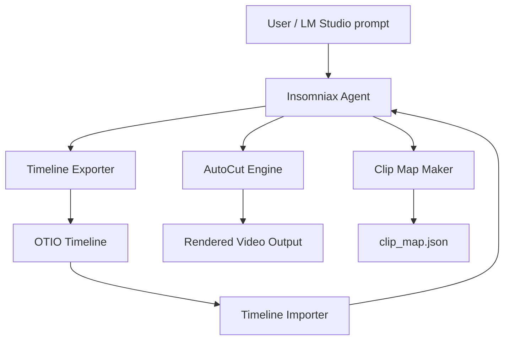

# 🤖 AGENTS.md — Insomniax Agent Registry

This document defines the registered agents, tools, and modules available within the **Insomniax Agent** ecosystem.  
Each agent is self-contained but interoperable under a shared local runtime and configuration model.

---

## 🧩 Core Agent Overview

| Agent | Role | Primary File | Description |
|--------|------|---------------|--------------|
| **Insomniax Agent** | Primary orchestrator | `insomniax_agent_v4.py` | Conversational controller that manages cue-sheet data, OTIO sync, and file versioning. Integrates directly with LM Studio’s local API for structured editing. |
| **AutoCut Engine** | Procedural video generator | `insomniax_autocut_v3.py` | Uses FFmpeg to produce beat-synced experimental cuts. Driven by `clip_map.json` and audio analysis. |
| **Timeline Exporter** | OTIO writer | `insomniax_to_otio_extended.py` | Converts `insomniax.json` cue-sheet data into a standardized OpenTimelineIO timeline. |
| **Timeline Importer** | OTIO reader | `otio_to_insomniax_sync.py` | Reads updated `.otio` files and syncs changes back into `insomniax.json`. |
| **Clip Map Maker** | Media linking assistant | `clip_map_maker.py` | Builds or updates `clip_map.json` automatically from footage folder and cue-sheet keywords. |

---

## 🧠 Agent Capabilities Matrix

| Capability | Agent | Description |
|-------------|--------|-------------|
| JSON Structural Editing | Insomniax Agent | Parses and rewrites cue sheets dynamically from conversational input. |
| Audio Beat Detection | AutoCut Engine | Reads waveform data, builds cut points, and aligns to BPM grid. |
| File Versioning | Insomniax Agent | Saves timestamped backups of `insomniax.json` in `/versions/`. |
| Scene–Clip Linking | Clip Map Maker | Matches scene text keywords to video files; maintains `clip_map.json`. |
| OTIO Interchange | Timeline Exporter / Importer | Handles export/import of `.otio` timelines for NLE round-trips. |
| Local LM Studio API | All | Shared configuration for local inference (OpenAI-compatible endpoint). |

---

## ⚙️ Agent Communication Flow

---

## 🪶 Configuration Notes

**Shared Files**
| File | Purpose |
|------|----------|
| `insomniax.json` | Main cue sheet (keyframes, scene data, VO, FX, timing). |
| `clip_map.json` | Auto-generated map linking scene keywords to footage paths. |
| `soundtrack_mix.wav` | Primary reference track for beat-sync operations. |
| `/footage/` | Directory containing video assets. |
| `/segments_v3/` | Temporary output of rendered fragments. |
| `/versions/` | Auto-backups of cue sheets and timelines. |

**Runtime Environment**
- Python ≥ 3.11  
- FFmpeg installed and accessible in `PATH`  
- LM Studio running locally at `http://localhost:1234/v1`  
- Works offline (no cloud dependencies)

---

## 🧩 Future Agents (Planned)

| Agent | Purpose | Phase |
|--------|----------|--------|
| **Interactive Reviewer** | Terminal-based approval loop for clip-map verification. | v5.0 |
| **Semantic Match Engine** | Embedding-based fuzzy matching between scene text and clip names. | v6.0 |
| **Spectral Analyzer** | Audio-driven pacing logic and density adjustment for AutoCut. | v6.0 |
| **Web Control Panel** | FastAPI dashboard for project visualization and playback. | v7.0 |

---

## 🔗 Integration Hooks

| Hook | Trigger | Response |
|------|----------|-----------|
| `generate_clip_map()` | New footage or updated cue sheet detected | Rebuilds clip map automatically |
| `sync_from_otio()` | OTIO file imported | Updates `insomniax.json` |
| `render_autocut()` | User command or schedule trigger | Generates latest experimental edit |
| `summarize_timeline()` | User query | Outputs structured sequence summary |

---

## 🧾 License

MIT License — © 2025 Matthew Ballard  
*(See `LICENSE` file for details.)*

---

© 2025 *Insomniax Agent — Local AI-Assisted Editing Framework*
